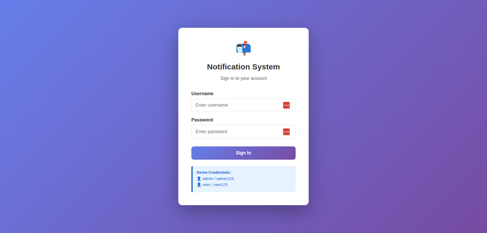
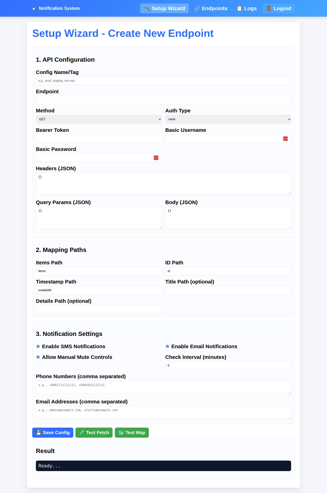
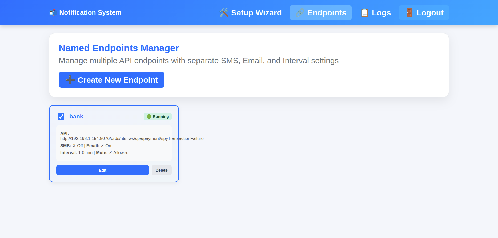
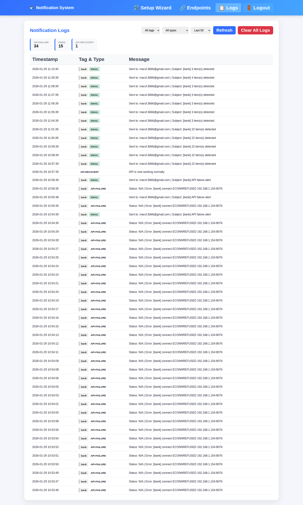
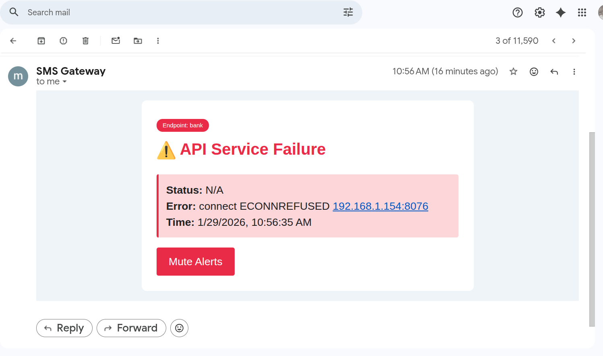

# API Monitoring & Notification System

A comprehensive notification system that monitors any API endpoints for errors and changes, sending real-time alerts through SMS and Email channels. Features intelligent muting controls, logging dashboard, and a web-based configuration interface with user authentication.



## 📋 Table of Contents

- [Features](#features)
- [Screenshots](#screenshots)
- [Quick Start](#quick-start)
- [Documentation](#documentation)
- [Architecture](#architecture)
- [Installation](#installation)
- [Usage](#usage)
- [API Reference](#api-reference)
- [Configuration](#configuration)
- [Support](#support)

## ✨ Features

- 🔔 **Multi-Channel Notifications**: Send alerts via SMS and Email
- 🔐 **User Authentication**: Secure login system with session management
- 🎛️ **Dynamic Configuration**: Web UI to enable/disable channels and manage recipients
- 🔇 **Smart Muting**: Time-based and auto-unmute controls for API alerts
- 📊 **Logging Dashboard**: View, filter, and analyze all notification activities
- 🚨 **API Monitoring**: Automatic error detection and failure recovery notifications
- ⚙️ **Live Configuration**: Change settings without restarting the application
- 🔄 **Auto-Recovery**: Unmutes automatically on timer expiry or when API recovers
- 🎨 **Modern UI**: Responsive design with dark theme and intuitive controls
- 📱 **Multiple Endpoints**: Support for monitoring multiple API endpoints simultaneously

## 📸 Screenshots

### Login Page

*Secure authentication system with session management*

### Setup Wizard

*Initial configuration wizard for easy setup*

### Endpoint Management

*Manage multiple payment endpoints with individual controls*

### Logs Dashboard

*Real-time logs with filtering and statistics*

### Email Notifications

*Professional email notifications with action buttons*

## 🚀 Quick Start

```bash
# Clone the repository
git clone <repository-url>
cd notification

# Install dependencies
npm install

# Configure environment
cp .env.example .env
# Edit .env with your settings

# Start the system
npm start

# Access the web interface
# Login: http://localhost:3000/login
# Default credentials: admin / admin123
```

For detailed setup instructions, see [Installation Guide](docs/INSTALLATION.md) or [Quick Start Guide](docs/QUICK_START.md).

## 📚 Documentation

### Getting Started
- **[Quick Start Guide](docs/QUICK_START.md)** - Get up and running in minutes
- **[Installation Guide](docs/INSTALLATION.md)** - Detailed installation instructions
- **[Setup Guide](docs/SETUP_GUIDE.md)** - Complete system setup walkthrough
- **[UI Setup Guide](docs/UI_SETUP_GUIDE.md)** - Configure the web interface

### Configuration & Usage
- **[Configuration Guide](docs/CONFIGURATION.md)** - All configuration options explained
- **[Usage Guide](docs/USAGE_GUIDE.md)** - How to use the system effectively
- **[Multiple Endpoints Setup](docs/MULTIPLE_ENDPOINTS_SETUP.md)** - Configure multiple payment APIs
- **[Multiple Endpoints Quick Reference](docs/MULTIPLE_ENDPOINTS_QUICK_REF.md)** - Quick reference for multi-endpoint features
- **[Named Endpoints Guide](docs/NAMED_ENDPOINTS_GUIDE.md)** - Name and organize your endpoints

### Technical Documentation
- **[Architecture](docs/ARCHITECTURE.md)** - System architecture and design
- **[Structure](docs/STRUCTURE.md)** - Project structure and file organization
- **[API Reference](docs/API_REFERENCE.md)** - Complete API documentation
- **[API Documentation](docs/API.md)** - Additional API details

### Testing & Troubleshooting
- **[Testing Guide](docs/TESTING.md)** - How to run tests
- **[Troubleshooting](docs/TROUBLESHOOTING.md)** - Common issues and solutions

### Deployment & Advanced
- **[Deployment Guide](docs/DEPLOYMENT.md)** - Production deployment instructions
- **[Implementation Notes](docs/IMPLEMENTATION_NOTES.md)** - Technical implementation details
- **[Project Completion Checklist](docs/PROJECT_COMPLETION_CHECKLIST.md)** - Development checklist

### Complete Documentation
- **[Documentation Summary](docs/DOCUMENTATION_SUMMARY.md)** - Overview of all documentation
- **[Complete Documentation](docs/DOCUMENTATION_COMPLETE.md)** - All documentation in one file

## 🏗️ Architecture

```
┌─────────────────────────────────────────────────────────────┐
│              API Monitoring & Notification System            │
├─────────────────────────────────────────────────────────────┤
│                                                               │
│  ┌──────────────┐      ┌──────────────┐      ┌───────────┐ │
│  │   Scheduler  │─────▶│  API Client  │─────▶│  Target   │ │
│  │ (scheduler.js)│      │   (api.js)   │      │    APIs   │ │
│  └──────────────┘      └──────────────┘      └───────────┘ │
│         │                    │                               │
│         │               ┌────┴────┐                         │
│         │               │  Error  │                         │
│         │               │Detector │                         │
│         │               └────┬────┘                         │
│         │                    │                               │
│         ├──────────┬─────────┴──────┬──────────┐           │
│         ▼          ▼                ▼          ▼            │
│  ┌──────────┐ ┌────────┐      ┌────────┐ ┌────────┐       │
│  │  Logger  │ │  SMS   │      │ Email  │ │ State  │       │
│  │(logger.js)│ │(sms.js)│      │(email) │ │Manager │       │
│  └──────────┘ └────────┘      └────────┘ └────────┘       │
│                                                               │
│  ┌─────────────────────────────────────────────────────┐    │
│  │           Control Server (control-server.js)         │    │
│  │  • User authentication & sessions                    │    │
│  │  • Web UI for settings                               │    │
│  │  • Multiple endpoint management                      │    │
│  │  • Mute/unmute controls                              │    │
│  │  • Logging API & dashboard                           │    │
│  │  • Real-time configuration                           │    │
│  └─────────────────────────────────────────────────────┘    │
│                                                               │
│  ┌─────────────────────────────────────────────────────┐    │
│  │      Email/SMS Gateway (email-sms-gateway/)          │    │
│  │  • Teletalk SMS integration                          │    │
│  │  • Email SMTP service                                │    │
│  └─────────────────────────────────────────────────────┘    │
└─────────────────────────────────────────────────────────────┘
```

For detailed architecture information, see [Architecture Guide](docs/ARCHITECTURE.md).

## 📦 Installation
Target API endpoints to monitor
### Prerequisites

- Node.js (v16 or higher)
- npm or yarn
- Access to payment API endpoint
- SMS gateway credentials (Teletalk)
- SMTP email server credentials

### Basic Installation

1. **Install dependencies**
   ```bash
   npm install
   cd email-sms-gateway && npm install && cd ..
   ```

2. **Configure environment**
   ```bash
   cp .env.example .env
   ```
   
   Edit `.env`:
   ```env
   NODE_ENV=production
   CONTROL_SERVER_PORT=3000
   ```

3. **Configure SMS/Email Gateway**
   
   Create `email-sms-gateway/.env`:
   ```env
   # Teletalk SMS Configuration
   TELETALK_BASE_URL=https://vas.teletalk.com.bd/cgi-bin/httpnorm
   TELETALK_USERNAME=your_username
   TELETALK_PASSWORD=your_password
   TELETALK_MASK=YourMask

   # Email SMTP Configuration
   SMTP_HOST=smtp.gmail.com
   SMTP_PORT=587
   SMTP_SECURE=false
   SMTP_USER=your-email@gmail.com
   SMTP_PASS=your-app-password

   PORT=9090
   ```

4. **Start the system**
   ```bash
   npm start
   ```

For detailed installation instructions, see [Installation Guide](docs/INSTALLATION.md).

## 🎮 Usage

### Starting the System

**Production mode:**
```bash
NODE_ENV=production npm start
```

**Development mode with auto-reload:**
```bash
npm run dev
```

**Start SMS/Email Gateway:**
```bash
cd email-sms-gateway
npm start
```

### Web Interfaces
API endpoints |
| Configuration | `http://localhost:3000/config/ui` | System settings |
| Logs | `http://localhost:3000/logs/ui` | View logs and statistics |
| Mute Controls | `http://localhost:3000/mute/api/ui` | Mute API
| Setup Wizard | `http://localhost:3000/setup` | Initial configuration |
| Endpoints | `http://localhost:3000/endpoints/ui` | Manage payment endpoints |
| Configuration | `http://localhost:3000/config/ui` | System settings |
| Logs | `http://localhost:3000/logs/ui` | View logs and statistics |
| Mute Controls | `http://localhost:3000/mute/payment/ui` | Mute payment alerts |

### Default Credentials

- **Username:** `admin`
- **Password:** `admin123`

⚠️ **Important:** Change the default password in `controllerServer/users.json` before deployment.

For detailed usage instructions, see [Usage Guide](docs/USAGE_GUIDE.md).

## 🔌 API Reference

### Authentication

```bash
POST /api/login
Content-Type: application/json

{
  "username": "admin",
  "password": "admin123"
}
```

### Configuration Endpoints

```bash
# Get current configuration
GET /config

# Update configuration
POST /config
Content-Type: application/json

{
  "phoneNumbers": "01XXXXXXXXX",
  "emailAddresses": "user@example.com",
  "checkIntervalMinutes": 0.5,
  "enableSms": true,
  "enableEmail": true
}
```

### Endpoint Management

```bash
# List all endpoints
GET /api/endpoints

# Add new eUser Service API",
  "url": "http://api.example.com/user
Content-Type: application/json

{
  "name": "Main Payment API",
  "url": "http://api.example.com/payments",
  "enabled": true
}

# Update endpoint
PUT /api/endpoints/:id

# Delete endpoint
DELETE /api/endpoints/:id
```

### Logging

```bash
# Get logs with filters
GET /api/logs?lines=100&type=SMS

# Clear logs
DELETE /api/logs
```

### Mute Controls

```bash
# Mute API alerts for specific duration
GET /mute/api?minutes=30

# Mute API failure alerts
GET /mute/api

# Unmute API alerts
GET /unmute/api

# Reset monitoring history
GET /reset/api
```

For complete API documentation, see [API Reference](docs/API_REFERENCE.md).

## ⚙️ Configuration

### Environment Modes

**Development Mode:**
- Detailed logging
- Debug information
- Verbose output

**Production Mode:**
- Clean logs
- Better performance
- Essential information only

Set in `.env`:
```env
NODE_ENV=production
```

### Key Configuration Options

| Option | Description | Default |
|--------|-------------|---------|
| `CONTROL_SERVER_PORT` | Web interface port | 3000 |
| `CHECK_INTERVAL` | API polling interval | 30 seconds |
| `ENABLE_SMS` | Enable SMS notifications | true |
| `ENABLE_EMAIL` | Enable email notifications | true |
| `ENABLE_MANUAL_MUTE` | Enable mute controls | true |

For complete configuration guide, see [Configuration Guide](docs/CONFIGURATION.md).

## 🛠️ Troubleshooting

### Common Issues

**Notifications not sending:**
- Check SMS/Email toggles in settings
- Verify recipients are configured
- Ensure gateway is running
- Review logs dashboard

**Cannot access web interface:**
- Verify port 3000 is not blocked
- Check firewall settings
- Ensure server is running

**SMS gateway errors:**
- Verify Teletalk credentials
- Check account balance
- Review mask configuration

**Email not delivering:**
- Verify SMTP credentials
- Check port configuration (587/465)
- Enable app-specific password (Gmail)

For detailed troubleshooting, see [Troubleshooting Guide](docs/TROUBLESHOOTING.md).

## 🚢 Production Deployment

### Using PM2 (Recommended)

```bash
# Install PM2
npm install -g pm2

# Start all services
pm2 start ecosystem.config.js

# Save configuration
pm2 save

# Enable startup script
pm2 startup
```

### Using systemd

Create service files and enable:
```bash
sudo systemctl enable notification-scheduler
sudo systemctl start notification-scheduler
```

For detailed deployment instructions, see [Deployment Guide](docs/DEPLOYMENT.md).

## 🔒 Security Considerations

1. **Authentication:**
   - Change default password immediately
   - Use strong passwords
   - Implement session timeout

2. **Network Security:**
   - Use firewall rules
   - Implement HTTPS with reverse proxy
   - Restrict IP access

3. **Credentials:**
   - Never commit `.env` files
   - Use environment variables
   - Rotate passwords and API keys regularly

4. **Logs:**
   - May contain sensitive API data
   - Implement log rotation
   - Restrict file permissions

## 📁 Project Structure

```
notification/
├── controllerServer/          # Main application server
│   ├── server.js             # Notification scheduler
│   ├── control-server.js     # Web interface & API
│   ├── api.js                # Payment API client
│   ├── config.js             # Configuration management
│   ├── config-endpoints.js   # Endpoint management
│   ├── scheduler.js          # Notification scheduler
│   ├── email.js              # Email handler
│   ├── sms.js                # SMS handler
│   ├── logger.js             # Logging system
│   └── users.json            # User credentials
├── email-sms-gateway/        # SMS/Email gateway service
│   ├── server.js             # Gateway server
│   ├── teletalkClient.js     # Teletalk integration
│   └── emailClient.js        # Email SMTP client
├── tests/                    # Test suite
├── docs/                     # Documentation
└── assets/                   # Images and resources
```

For detailed structure information, see [Structure Guide](docs/STRUCTURE.md).

## 🧪 Testing

```bash
# Run all tests
npm test

# Run specific test suite
npm run test:gateway
npm run test:server

# Quick test
./tests/quick-test.sh
```

For testing guide, see [Testing Documentation](docs/TESTING.md).

## 📄 License

ISC

## 💬 Support

For issues and questions:
- Check the [Troubleshooting Guide](docs/TROUBLESHOOTING.md)
- Review the [Complete Documentation](docs/DOCUMENTATION_COMPLETE.md)
- Check logs at the logs dashboard
- Test components using debug scripts

## 🗺️ Version History

### 2.0.0 (Current)
- User authentication system
- Multiple endpoint support
- Named endpoints with custom identifiers
- Enhanced UI with dark theme
- Setup wizard for easy configuration
- Improved security features
- Session management
- Documentation reorganization

### 1.0.0
- Initial release
- Multi-channel notifications (SMS, Email)
- Web-based configuration
- Mute controls with timer
- Logging dashboard
- API error detection and monitoring
- Auto-unmute logic

---

**Made with ❤️ for efficient API monitoring**

For more information, explore the [complete documentation](docs/).
